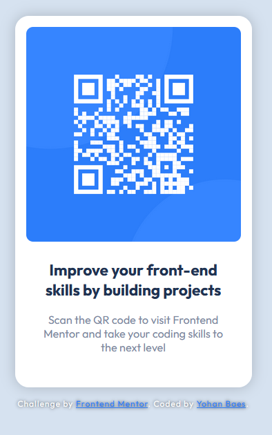

# Frontend Mentor - QR code component

This is a solution to the [QR code component challenge on Frontend Mentor](https://www.frontendmentor.io/challenges/qr-code-component-iux_sIO_H).

## The challenge

Your challenge is to build out this card component and get it looking as close to the design as possible.

## Screenshot

## Links

- Solution URL: https://www.frontendmentor.io/solutions/qr-code-component-challenge-responsive-solution-html-and-css-gNiu4YapDN
- Live Site URL: https://raink31.github.io/02-QR-code-component-challenge/

## Built with

- HTML5
- CSS
- Flexbox

## Author

- Frontend Mentor - https://www.frontendmentor.io/profile/Raink31
